# Qwen3.5-Omni Stage 因果图

生成时间 UTC：`2026-06-21T02:00:21.811436+00:00`。
工作目录：`/home/gangouyu/sglang-omni`。

这页把 stage breakdown 里的 queue、compute、handoff、collect wait 和 offline
runner admission 关系画成因果图，用来回答 reviewer 最容易追问的两件事：
stage 之间有没有卡住，以及一个 stage 的变化会不会把瓶颈转移到另一个 stage。

## 1. 机器 Gate

| Gate | 当前值 | 判定 |
| --- | --- | --- |
| stage interaction rows | `37` | bottleneck=1, contention_regression=1, diagnostic_only=2, healthy=28, prompt_feed_limited=2, queue_limited=2, watch=1 |
| SGLang handoff | talker->code2wav healthy=`True`；decode not bottleneck=`True` | PASS |
| vLLM offline diagnosis | original c8 prompt-feed limited=`True` | 只做诊断，不做 online parity |
| anti-recipe guard | preprocessing parallelism regresses=`True` | preproc=2/4 不作为当前 recipe |
| final readiness | ready=`True`；headline checks=`9/9` | 分享前门禁 |

## 2. Stage 因果图

```mermaid
flowchart LR
    Client["client request"] --> Admission["request admission / queue"]
    Admission --> Preproc["preprocessing lifecycle"]
    Preproc --> Thinker["thinker / encoder"]
    Thinker --> Talker["talker AR / codec cadence"]
    Talker --> Hop["talker -> code2wav stream hop"]
    Hop --> Collect["code2wav window collect"]
    Collect --> Decode["code2wav decode"]
    Decode --> Audio["audio response"]

    Admission -. c8/c16 queue grows .-> Preproc
    Preproc -. naive preproc=2/4 adds contention .-> Thinker
    Talker -. chunk cadence drives collect wait .-> Collect
    Hop -. healthy p95 ~15-24ms .-> Collect
    Decode -. decode p95 ~18-26ms, not bottleneck .-> Audio

    VPrompt["vLLM offline prompt build/feed"] --> VAdmission["vLLM engine admission"]
    VAdmission --> VThinker["vLLM thinker"]
    VThinker --> VTalker["vLLM talker"]
    VTalker --> VC2W["vLLM code2wav"]
    VPrompt -. original c8 prompt-feed limited .-> VAdmission
    VAdmission -. prebuild w4 lowers admission span .-> VTalker
```

## 3. SGLang 关键因果边

| 因果边 | 证据 | 结论 | 优先动作 |
| --- | --- | --- | --- |
| admission -> preprocessing lifecycle | c8 lifecycle `1226.6ms`，actual preprocess `289.2ms`；c16 lifecycle `4395.1ms`，actual preprocess `304.6ms` | 高并发慢主要是 admission/queue，不是预处理 compute 突然变慢 | 调 admission/batching，不先加 worker |
| preprocessing widening -> thinker/encoder contention | preproc=2 QPS delta `-35.4%` | 朴素加 preprocessing 并发把排队问题转成共享资源争用 | 保持 preproc=1，除非同步改 placement/admission |
| talker AR -> code2wav collect wait | c8 collect `68.1ms` vs decode `17.2ms`；c16 collect `61.0ms` vs decode `16.7ms` | collect 变长主要是在等 talker codec chunk，不等于 vocoder compute 慢 | 优先看 talker cadence 和 chunk policy |
| talker -> code2wav stream hop | c8 hop p95 `20.4ms`；c16 hop p95 `19.7ms` | stage handoff 本身健康，不是当前高并发瓶颈 | 不把连接层误判为主瓶颈 |
| code2wav decode -> audio response | c8 decode p95 `25.9ms`；c16 decode p95 `23.9ms` | decode 是十几到二十几 ms 量级，不是当前主要 compute bottleneck | 保持 compile 路径，优先优化 talker/admission |

## 4. vLLM 诊断因果边

| 因果边 | 证据 | 结论 | 对外边界 |
| --- | --- | --- | --- |
| prompt build/feed -> engine admission | original c8 admission avg/p95 `33314.0ms` / `43972.7ms` | 原始 offline c8 被 runner/admission 限制 | 不能拿 original c8 wall QPS 做 serving parity |
| prebuild w4 -> lower admission span -> later tail exposed | prebuild admission avg/p95 `4089.0ms` / `4891.5ms` | prebuild 缓解 prompt/admission，但暴露 engine/talker-side tail | 仍需 online ingress + WER/ASR 才能做 c8 parity |

## 5. Regime 读法

| Regime | 证据 | 因果解释 | Reviewer 口径 |
| --- | --- | --- | --- |
| c=8 | acc=70.0%, WER=3.23%, lat_mean=3.064s, lat_p95=5.853s, QPS=2.540, hop_p95=20.4ms, decode_p95=25.9ms | admission 开始显性，但 handoff/decode 仍健康 | 当前高并发吞吐峰值 |
| c=16 | acc=70.0%, WER=2.88%, lat_mean=6.066s, lat_p95=7.846s, QPS=2.407, hop_p95=19.7ms, decode_p95=23.9ms | queue/admission 饱和，吞吐回落 | 压力边界，不是默认服务点 |
| preproc=2 | baseline_QPS=2.540, preproc2_QPS=1.642, baseline_lat=3.064s, preproc2_lat=4.579s | resource contention 盖过并发收益 | 反例 recipe |

## 6. 原始证据 Drilldown

这张表把因果图里的关键边直接映射到 raw local artifact。share bundle 内只携带
摘要、审计 JSON、图表和校验工具；需要重新追溯原始 profile/run log 时，按这些路径在
`/home/gangouyu/sglang-omni` 工作区或复跑结果目录中检查。
这些 raw artifact path 由 `manifest.json` 背书；final readiness 会校验它们存在于
manifest 证据清单中，避免 drilldown 变成未登记的手写路径。

| 追问 | 先看机器摘要 | Raw artifact drilldown | 证明什么 |
| --- | --- | --- | --- |
| SGLang c=8/c=16 高并发为什么是 admission/queue | `stage_latency_budget.json`；`stage_interaction_summary.json` | `results/qwen35_sglang_mr8_stress_20260619/benchmark_audio_50_c8_profile_skipwer/videoamme_results.json` `results/qwen35_sglang_mr8_stress_20260619/benchmark_audio_50_c8_profile_skipwer/whisper_large_v3_local_wer.json` `results/qwen35_sglang_mr8_stress_20260619/request_profile_c8_profile_skipwer.json` `results/qwen35_sglang_mr8_stress_20260619/benchmark_audio_50_c16_profile_skipwer/videoamme_results.json` `results/qwen35_sglang_mr8_stress_20260619/benchmark_audio_50_c16_profile_skipwer/whisper_large_v3_local_wer.json` `results/qwen35_sglang_mr8_stress_20260619/request_profile_c16_profile_skipwer.json` | 同时复核 QPS/latency/WER、preprocessing lifecycle、actual preprocess、hop 和 decode span |
| SGLang talker->code2wav handoff 是否卡住 | `stage_boundary_bottleneck_ledger.json` rows `talker_to_code2wav_stream` | `results/qwen35_sglang_mr8_stress_20260619/request_profile_c8_profile_skipwer.json` `results/qwen35_sglang_mr8_stress_20260619/request_profile_c16_profile_skipwer.json` | 检查 hop p95 约 20ms，而 talker tail 是秒级；连接不是主瓶颈 |
| 短/长文本语音是否覆盖，并且 long c=8 是否快于实时 | `tables_summary.json` synthetic rows；`stage_latency_budget.json` | `results/qwen35_synthetic_speech_20260619/short_c8/synthetic_speech_results.json` `results/qwen35_synthetic_speech_20260619/request_profile_short_c8_profile.json` `results/qwen35_synthetic_speech_20260619/long_c8/synthetic_speech_results.json` `results/qwen35_synthetic_speech_20260619/request_profile_long_c8_profile.json` | 复核 short/long 输入形态、RTF、talker AR、code2wav decode 和 hop |
| vLLM original c=8 为什么不能当 online parity | `vllm_admission_diagnosis.json` row `vLLM-c8` | `results/qwen35_vllm_videoamme_ci50_offline_compile_c8_mns8_20260619_20260619_222434/benchmark_audio_50_c8_offline_compile/videoamme_results.json` `results/qwen35_vllm_videoamme_ci50_offline_compile_c8_mns8_20260619_20260619_222434/run.log` | 复核 runner overhead、batch admission span 和 prompt-feed limited 诊断 |
| vLLM c=8 prebuild w4 改善了什么，为什么仍是 diagnostic | `vllm_admission_diagnosis.json` row `vLLM-c8-prebuild-w4`；`vLLM online parity protocol` | `results/qwen35_vllm_videoamme_ci50_offline_compile_c8_mns8_prebuildw4_20260620_005346/benchmark_audio_50_c8_offline_compile/videoamme_results.json` `results/qwen35_vllm_videoamme_ci50_offline_compile_c8_mns8_prebuildw4_20260620_005346/run.log` | 复核 admission span 降低、engine/talker tail 暴露，以及缺少 online ingress/WER 的边界 |

## 7. 复核入口

- stage interaction summary：`results/qwen35_report_audit_20260619/stage_interaction_summary.json`
- stage latency budget：`results/qwen35_report_audit_20260619/stage_latency_budget.json`
- stage boundary bottleneck ledger：`results/qwen35_report_audit_20260619/stage_boundary_bottleneck_ledger.json`
- tables summary raw path index：`results/qwen35_report_audit_20260619/tables_summary.json`
- vLLM admission diagnosis：`results/qwen35_report_audit_20260619/vllm_admission_diagnosis.json`
- regime decision matrix：`benchmarks/reports/qwen35_omni_regime_decision_matrix_zh_20260621.md`
- regime decision matrix JSON：`results/qwen35_report_audit_20260619/regime_decision_matrix.json`
- stage metric dictionary：`benchmarks/reports/qwen35_omni_stage_metric_dictionary_zh_20260621.md`
- optimization playbook：`benchmarks/reports/qwen35_omni_optimization_playbook_zh_20260621.md`
